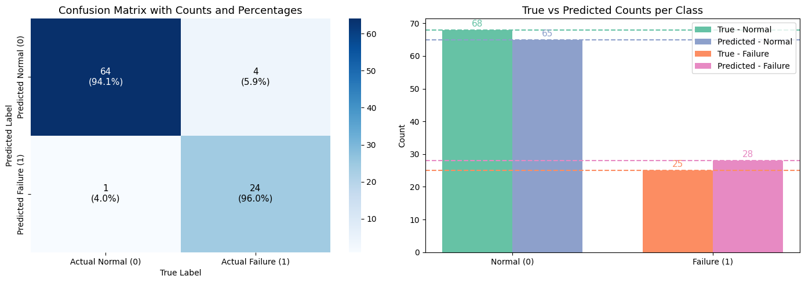

# Gossip-Based LSTM for Predictive Maintenance

In this project, I worked on a decentralized predictive maintenance system using LSTM networks and a simple gossip communication strategy. The goal was to detect failures in turbofan engines by training local models on each engine’s data and then sharing model weights between nodes in a distributed setup.

## 📉 Prediction vs Actual

This plot shows the comparison between the actual labels and the model predictions on the test set:

## 📊 Dataset
I used the NASA C-MAPSS dataset, which contains sensor readings from jet engines. You can find the version I used here:  
👉 [Kaggle - NASA C-MAPSS Dataset](https://www.kaggle.com/datasets/maternusherold/pred-maintanance-data)

## 🔧 Tools & Libraries
- Python  
- Pandas, NumPy, Matplotlib, Seaborn  
- Scikit-learn  
- TensorFlow / Keras  
- Gossip-based weight sharing (custom implementation)

## 🚀 What I Did
- Trained a separate LSTM model for each engine’s data  
- Simulated weight-sharing between models using a gossip protocol (ring topology)  
- Preprocessed and normalized the data, calculated Remaining Useful Life (RUL), and generated binary failure labels  
- Focused on keeping the system simple and decentralized — no central coordinator

## 💡 What I Learned
- How to implement distributed training logic from scratch  
- How gossip algorithms work in collaborative learning setups  
- Best practices for time-series modeling with LSTM  
- The importance of preprocessing and label engineering in PdM

---

